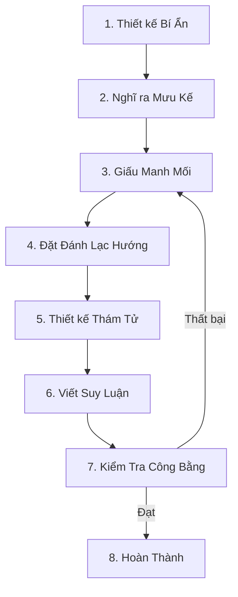

# Các Yếu Tố Cốt Lõi Của Truyện Trinh Thám Cổ Điển

> **Nguyên tắc cốt lõi**: Bản chất của truyện trinh thám cổ điển (Honkaku) là "trò chơi trí tuệ giữa độc giả và thám tử" — tất cả manh mối phải được trình bày công bằng, và sự thật phải có thể suy luận được.

---

## Vietnamese Writing Patterns

### From Ta Dung Nhin Vo Lam Toang & Sources:
- Dialogue format: "Content" + action tag
- Inner thoughts: third-person narrative without quotes
- Scene breaks: *** major, —0o0— minor
- Pronouns: mày/tao (close), tôi/ngài (formal), hắn (antagonist)
- First-person internal: cậu/mình

### 8 Error Types to Avoid:
1. Units: mét/cm/km/kg (NOT trượng/dặm/tấc/thốn)
2. Vocabulary: context-appropriate
3. Punctuation: — single (NOT ——)
4. Sentence: complete (subject + predicate)
5. Spelling: natural Vietnamese
6. Connectors: và/nhưng/nên/vì/rồi/thì
7. Subject: explicit in descriptions
8. Natural rhythm

### Genre-Specific Patterns:

#### Xuanhuan/Cultivation:
- Use mét/cm/km for distances (NOT trượng)
- Power levels: Trúc Cơ, Kim Đan, Nguyên Anh
- Dragon descriptions from Bien Nien Su Rong style

#### Isekai/Gaming:
- Status card format with "Keng!" notifications
- Combat: short → explanation → short punch
- Level-up pacing with 5% recovery chance

#### Romance/Fire Strand:
- Show-don't-tell emotion markers
- Building slow, conflict before resolution
- Body language over telling emotions

#### Rules-Mystery:
- Clue placement patterns
- Revelation timing
- Suspense building

---

## 1. Truyện Trinh Thám Cổ Điển (Honkaku) Là Gì?

### Định nghĩa
**Truyện Trinh Thám Cổ Điển (Honkaku)**: Còn gọi là "suy luận chính thống" hoặc "fair play deduction", nhấn mạnh **suy luận logic** và **công bằng manh mối**. Độc giả và thám tử bắt đầu từ cùng mức thông tin, có thể lý thuyết suy ra sự thật trước khi được tiết lộ.

### Khác Biệt với Social/Hard-Boiled
| Loại | Cốt lõi | Trọng tâm | Ví dụ |
|------|---------|-----------|-------|
| **Truyện Trinh Thám Cổ Điển** | Giải câu đố | Phòng kín/mưu kế/logic | The Murder Room |
| **Social** | Bản chất con người/động cơ | Nguyên nhân tội phạm/phê phán xã hội | Byakuya Kou |
| **Hard-Boiled** | Khí quyển/bạo lực | Cuộc phiêu lưu thám tử/phong cách đen | The Maltese Falcon

---

## 2. "Mười Điều Răn" Của Truyện Trinh Thám Cổ Điển (Phiên Bản Điều Chỉnh)

### Mười Điều Răn Gốc Của Knox (1929)
Một số quy tắc đã lỗi thời. Dưới đây là **phiên bản web novel đã điều chỉnh**:

**Điều Răn 1**: Thủ phạm phải xuất hiện sớm trong câu chuyện  
**Điều Răn 2**: Lực lượng siêu nhiên không được dùng để giải thích sự thật (nhưng có thể dùng để đánh lạc hướng)  
**Điều Răn 3**: Một phòng kín có thể có nhiều nhất một đường hầm bí mật  
**Điều Răn 4**: Chất độc hoặc thiết bị không xác định đòi hỏi giải thích khoa học dài dòng bị cấm  
**Điều Răn 5**: Không có ký tự Trung Quốc (phiên bản gốc phân biệt chủng tộc, **đã lỗi thời**) → **Sửa đổi thành: Không có người bí ẩn hoàn toàn chưa xuất hiện có thể là thủ phạm**  
**Điều Răn 6**: Thám tử không thể giải quyết vụ án dựa vào may mắn hoặc linh cảm  
**Điều Răn 7**: Chính thám tử không thể là thủ phạm (trừ khi có cài đặt đôi thám tử)  
**Điều Răn 8**: Thám tử phải tiết lộ tất cả manh mối cho độc giả  
**Điều Răn 9**: Trợ lý của thám tử (vai trò Watson) phải có suy nghĩ minh bạch với độc giả  
**Điều Răn 10**: Song sinh/phân thân phải được gợi ý ở giai đoạn sớm  

---

## 3. Bốn Trụ Cột Của Truyện Trinh Thám Cổ Điển

### Trụ Cột 1: Công Bằng
**Định nghĩa**: Độc giả và thám tử có thông tin giống nhau, có thể lý thuyết suy ra sự thật.

**Phương pháp thực hiện**:
```
✅ Ví dụ đúng
Chương 10: Thám tử phát hiện mảnh bình (độc giả nhìn cùng lúc)
Chương 20: Thám tử suy luận: "Cái bình vỡ từ bên trong"
→ Độc giả có thể xem lại Chương 10 để kiểm tra

❌ Ví dụ sai
Chương 10: Thám tử phát hiện manh mối (nội dung không được mô tả)
Chương 20: Thám tử nói: "Tôi đã phát hiện ra manh mối quan trọng này từ lâu!"
→ Độc giả không thể kiểm tra, không công bằng
```

---

### Trụ Cột 2: Logic
**Định nghĩa**: Quá trình suy luận phải logic, không dựa vào linh cảm hay sự trùng hợp.

**Ví dụ chuỗi Logic**:
```markdown
## Vụ Án: Mua sát Phòng kín
**Manh mối đã biết**:
1. Nạn nhân ở trong phòng khoá
2. Cửa sổ khoá từ bên trong
3. Nạn nhân cầm chìa khoá

**Suy luận sai**:
"Tôi cảm giác thủ phạm là Trương Tam ở nhà bên cạnh"
→ Không có cơ sở logic

**Suy luận đúng**:
1. Nạn nhân cầm chìa → Hắn có thể tự khoá cửa
2. Cửa sổ khoá từ bên trong → Thủ phạm không trốn qua cửa sổ
3. Phòng khoá → Thủ phạm có thể rời đi trước khi nạn nhân khoá cửa
4. → Ước lượng: Nạn nhân bị giết bởi người giấu trong phòng sau khi nạn nhân khoá cửa
5. → Tìm nơi giấu trong phòng (tủ/under bed/trần)
```

---

### Trụ Cột 3: Có Thể Giải Được
**Định nghĩa**: Sự thật phải **có thể** để độc giả suy luận, không hoàn toàn bất ngờ.

**Tiêu chuẩn có thể giải được**:
- ✅ Độc giả được giác ngộ sau đó: "Tất nhiên, là như vậy!"
- ❌ Độc giả vẫn bối rối sau đó: "Cái gì? Cái này cũng được?"

**Ví dụ**:
```markdown
✅ Twist có thể giải được
Manh mối: Nhật ký của nạn nhân viết "Gặp hắn ngày 15 tháng 7"
Sự thật: "Hắn" chỉ thủ phạm, nhật ký là bằng chứng

❌ Twist không thể giải được
Sự thật: Nạn nhân có một người em song sinh chưa bao giờ được đề cập
→ Độc giả không có cách nào đoán được
```

---

### Trụ Cột 4: Bất Ngờ
**Định nghĩa**: Sự thật vừa logic vừa bất ngờ.

**Công thức cân bằng**:
```
Công bằng (80% manh mối) + Che giấu (20% đánh lạc hướng) = Bất ngờ
```

**Ví dụ**:
```markdown
## Vụ Án: Murder on the Orient Express (Agatha Christie)
**Manh mối công bằng**: Tất cả 12 nghi phạm đều có alibi
**Đánh lạc hướng**: Ngụ ý thủ phạm là người ngoài
**Sự thật**: 12 người cùng thực hiện tội ác
**Bất ngờ**: Đảo ngược ý thức thông thường về "một thủ phạm"
```

---

## 4. Năm Yếu Tố Cốt Lõi Của Truyện Trinh Thám Cổ Điển

### Yếu Tố 1: Bí Ẩn
**Định nghĩa**: Bí ẩn cốt lõi thúc đẩy độc giả tiếp tục đọc.

**Các Loại Bí Ẩn Phổ Biến**:
| Loại | Câu hỏi | Ví dụ |
|------|---------|-------|
| **Who** | Ai là thủ phạm? | Nhiều người trong không gian kín, tìm thủ phạm |
| **How** | Làm thế nào? | Mua sát phòng kín, làm sao trốn thoát |
| **Why** | Tại sao? | Có vẻ không liên quan, tại sao giết |
| **When** | Khi nào? | Alibi giả mạo |
| **Where** | Ở đâu? | Thi thể bị di chuyển, hiện trường thực sự ở đâu

---

### Yếu Tố 2: Manh Mối
**Định nghĩa**: Bằng chứng chỉ đến sự thật, phải được **trình bày công bằng**.

**Phân loại Manh Mối**:
```markdown
## Bằng Chứng Vật Lý
- Vũ khí giết người, vân tay, vết máu, tóc, sợi vải
- Bằng chứng thời gian (đồng hồ dừng, ngày tháng nhật ký)
- Bằng chứng không gian (hướng dấu chân, vị trí vật dụng)

## Lời Khai Nhân Chứng
- Lời khai nhân chứng trực tiếp (có thể sai)
- Nhận dạng chuyên gia (pháp y, phòng thí nghiệm)

## Bằng Chứng Hành Vi
- Hành vi bất thường của nghi phạm
- Khe hở trong alibi
```

**Kỹ thuật giấu manh mối**:
```
1. Foreshadowing: "Tình cờ" đề cập vật quan trọng trước khi xảy ra án
2. Ngụy trang: Giấu manh mối trong mô tả môi trường
3. Lặp lại: Manh mối quan trọng xuất hiện 2-3 lần, tăng ấn tượng
```

---

### Yếu Tố 3: Red Herring
**Định nghĩa**: Cố tình đặt manh mối sai để hướng độc giả đến suy luận sai.

**Ví dụ**:
```markdown
## Vụ Án: Manh Mối Chỉ Người Vô Tội
Manh mối A: Dao của Trương Tam có vết máu
Manh mối B: Trương Tam có tranh chấp với nạn nhân
→ Độc giả suy đoán: Trương Tam là thủ phạm

Sự thật: Trương Tam là thợ săn, máu là máu động vật
          Tranh chấp là về nợ, không liên quan đến giết người
→ Thủ phạm thực sự là người khác
```

**Lưu ý**: Red herring phải **có thể giải thích sau đó**, không được hoàn toàn phi logic.

---

### Yếu Tố 4: Thám Tử
**Định nghĩa**: Người thực hiện suy luận, đại diện cho góc nhìn của độc giả.

**Các Loại Thám Tử**:
| Loại | Đặc điểm | Ví dụ |
|------|----------|-------|
| **Thiên tài** | Logic xuất chúng, bình tĩnh, lý trí | Sherlock Holmes |
| **Chân thành** | Dựa vào thông thường và điều tra kỹ lưỡng | Father Brown |
| **Nghiệp dư** | Thám tử không chuyên, tình cờ giải quyết vụ án | Jessica Fletcher |

**Cài đặt Web Novel Phổ Biến**:
- Thám tử tái sinh (biết một phần sự thật, nhưng phải suy luận lại)
- Thám tử có hệ thống hỗ trợ (nhận gợi ý manh mối)
- Đôi thám tử (một rõ ràng, một ẩn, hợp tác cuối cùng)

---

### Yếu Tố 5: Tiết Lộ Sự Thật
**Định nghĩa**: Thám tử chia sẻ công khai quá trình suy luận, giải thích tất cả nghi ngờ.

**Cấu trúc Tiết Lộ**:
```markdown
## Cấu Trúc Ba Phần Tiêu Chuẩn
1. Tổng kết vụ án (30%): Sắp xếp manh mối đã biết
2. Điểm bác từng điểm (50%): Loại trừ nghi phạm từng người, chỉ ra red herring
3. Xác định thủ phạm (20%): Tiết lộ mưu kế cốt lõi, nhận dạng thủ phạm
```

**Kỹ thuật Tiết Lộ**:
```
✅ Tầng tích lũy: Giải câu đố nhỏ trước, rồi tiết lộ cốt lõi
✅ Tạo twist: Chỉ đến A trước, rồi đột ngột chuyển sang B
✅ Để lại suspense: Giải thích 80%, để độc giả suy nghĩ 20% còn lại

❌ Đổ tất cả một lần: Nói tất cả thông tin trong một hơi
❌ Thám tử toàn năng: Thám tử đã biết trước nhưng không nói
```

---

## 5. Quy Trình Tạo Truyện Trinh Thám Cổ Điển

### Lưu Đồ


---

### Bước 1: Thiết kế Bí Ẩn
**Câu hỏi cốt lõi**: Bạn muốn độc giả đoán điều gì?

**Ví dụ**:
```
Bí Ẩn: Mua sát phòng kín — làm sao thủ phạm giết trong phòng khoá và trốn thoát?
```

---

### Bước 2: Nghĩ ra Mưu Kế
**Câu hỏi cốt lõi**: Sự thật là gì? Làm thế nào để thực hiện?

**Ví dụ**:
```
Mưu Kế: Thủ phạm giấu trong tủ của phòng trước, sau khi giết nạn nhân, đóng giả làm người phát hiện đầu tiên
```

---

### Bước 3: Giấu Manh Mối
**Câu hỏi cốt lõi**: Làm sao để độc giả **có thể** suy ra sự thật?

**Ví dụ**:
```
Manh mối 1 (Chương 5): Cửa tủ có vết trầy nhẹ
Manh mối 2 (Chương 10): Quần áo người phát hiện đầu tiên có bụi
Manh mối 3 (Chương 15): Một sợi tóc tìm thấy trong tủ
```

---

### Bước 4: Đặt Đánh Lạc Hướng
**Câu hỏi cốt lõi**: Làm sao để độc giả **không quá dễ** đoán sự thật?

**Ví dụ**:
```
Red herring 1: Dấu chân ngoài cửa sổ (thực ra là của người làm vườn)
Red herring 2: Nạn nhân cầm giấy tự tử (thực ra là tự sát giả)
```

---

### Bước 5: Thiết kế Thám Tử
**Câu hỏi cốt lõi**: Ai suy luận? Tính cách của họ là gì?

**Ví dụ**:
```
Thám tử: Thám tử về hưu của cảnh sát, kinh nghiệm nhưng không giỏi giao tiếp
Đặc điểm: Giải quyết vụ án qua quan sát chi tiết, không phải linh cảm thiên tài
```

---

### Bước 6: Viết Suy Luận
**Câu hỏi cốt lõi**: Thám tử tiếp cận sự thật từng bước như thế nào?

**Ví dụ**:
```
Chương 20: Phát hiện vết trầy trên tủ, nghi ngờ có người giấu trong đó
Chương 25: Phát hiện người phát hiện đầu tiên đang nói dối
Chương 30: Tiết lộ sự thật
```

---

### Bước 7: Kiểm Tra Công Bằng
**Checklist**:
- [ ] Tất cả manh mối quan trọng đã được trình bày cho độc giả?
- [ ] Quá trình suy luận có logic?
- [ ] Có dựa vào thông tin độc giả không biết?
- [ ] Tất cả red herring có thể giải thích hợp lý?
- [ ] Sự thật vừa bất ngờ vừa logic?

---

## 6. Các Bẫy Thường Gặp Trong Truyện Trinh Thám Cổ Điển

### Bẫy 1: Chênh Lệch Thông Tin
**Ví dụ sai**:
```
Thám tử (suy nghĩ): Tôi đã biết ai là thủ phạm rồi.
→ Độc giả không thể suy luận cùng lúc
```

**Cách tiếp cận đúng**:
```
Thám tử (suy nghĩ): Vết trầy trên cửa tủ... có thể là...
→ Gợi ý hướng suy luận, nhưng không nói thẳng
```

---

### Bẫy 2: Nhảy Cóc Logic
**Ví dụ sai**:
```
Manh mối: Có một sợi tóc tại hiện trường
Thám tử: Vậy thủ phạm là Trương Tam!
→ Thiếu bước suy luận trung gian
```

**Cách tiếp cận đúng**:
```
Manh mối: Có một sợi tóc tại hiện trường
Thám tử: Sợi tóc này đen và dài
     Chỉ có 3 phụ nữ ở hiện trường
     2 trong số họ tóc ngắn
     → Ước lượng: Thủ phạm là người phụ nữ tóc dài Lý Tứ
```

---

### Bẫy 3: Quá Dựa Vào Trùng Hợp
**Ví dụ sai**:
```
Thám tử tình cờ nhìn thấy thủ phạm xử lý vũ khí giết người
→ Giải quyết vụ án bằng may mắn
```

**Cách tiếp cận đúng**:
```
Thám tử truy vết manh mối và suy ra nơi giấu vũ khí giết người
→ Giải quyết vụ án qua logic
```

---

### Bẫy 4: Sự Thật Quá Phức Tạp
**Ví dụ sai**:
```
Sự thật: Thủ phạm dùng nguyên lý cơ học lượng tử để tạo phòng kín
→ Hoàn toàn không thể hiểu được đối với độc giả
```

**Cách tiếp cận đúng**:
```
Sự thật: Thủ phạm dùng đá để giữ then cửa, sau khi tan cửa tự động khoá
→ Đơn giản nhưng thông minh
```

---

## 7. Checklist Truyện Trinh Thám Cổ Điển

**Kiểm tra sau khi viết**:
- [ ] Bí ẩn có đủ hấp dẫn?
- [ ] Tất cả manh mối được trình bày công bằng?
- [ ] Logic suy luận có chặt chẽ?
- [ ] Red herring có thể giải thích sau đó?
- [ ] Sự thật vừa bất ngờ vừa logic?
- [ ] Quá trình suy luận của thám tử có rõ ràng?
- [ ] Có vi phạm "mười điều răn" nào?
- [ ] Độc giả **có thể** suy ra sự thật?

---

## 🛠️ Tham Khảo Nhanh Truyện Trinh Thám Cổ Điển

| Yếu tố | Điểm chính | Lỗi thường gặp | Cách tiếp cận đúng |
|---------|----------|---------------|-----------------|
| **Bí Ẩn** | Bí ẩn hấp dẫn | Bí ẩn quá đơn giản | Bí ẩn nhiều tầng |
| **Manh Mối** | Trình bày công bằng | Manh mối quan trọng bị ẩn | Trình bày ít nhất 2 lần |
| **Mưu Kế** | Vừa thông minh vừa giải được | Quá phức tạp | Nguyên lý đơn giản |
| **Suy Luận** | Logic chặt chẽ | Nhảy cóc logic | Suy luận từng bước |
| **Tiết Lộ** | Tầng tích lũy | Đổ tất cả một lần | Tiết lộ theo giai đoạn |

---

## Phụ Lục: Các Vụ Án Trinh Thám Cổ Điển

### Vụ Án 1: The Murder Room (Keigo Higashino)
**Bí Ẩn**: Giết người hàng loạt trong cabin núi kín, ai là thủ phạm?  
**Mưu Kế**: Nạn nhân thực ra là thủ phạm, giả làm nạn nhân  
**Công bằng**: Tất cả manh mối được trình bày, độc giả có thể suy luận  

---

### Vụ Án 2: And Then There Were None (Agatha Christie)
**Bí Ẩn**: Mười người trên hòn đảo biệt lập bị giết từng người, ai là thủ phạm?  
**Mưu Kế**: Thẩm phán giả chết, rồi tự sát  
**Công bằng**: Đồng dao gợi ý thứ tự giết người, tất cả manh mối được trình bày  

---

## Tóm Tắt

**Truyện Trinh Thám Cổ Điển = Công Bằng + Logic + Có Thể Giải Được + Bất Ngờ**

Nhớ rằng: Cốt lõi của truyện trinh thám cổ điển không phải để "khoe kỹ năng," mà là "cuộc thi công bằng." Độc giả và thám tử đứng trên cùng vạch xuất phát, tận hưởng niềm vui của suy luận.

---

## Appendix: Vietnamese Mystery Writing Patterns

### VN1. Vietnamese Detective Character Voice

**Ngài (formal address) vs Mày/Tao (casual):**
```
Formal investigation (ngài/tôi):
"—Ngài có thể cho biết, vào lúc ba giờ ngài ở đâu?"

Casual confrontation (mày/tao):
"Mày khai đi! Tao không có thời gian ngồi đây đợi mày!"
```

**Detective inner monologue patterns:**
- Formal: "Hắn ta... không đơn giản như vẻ bề ngoài."
- Colloquial: "Thằng này có vấn đề. Chắc chắn luôn."

### VN2. Mystery Building in Vietnamese

**Dấu ba chấm cho cliffhanger:**
```
"Bảy ngày…"
" bí ẩn còn đó…"
"Hắn ta đã làm điều đó…"
```

**Show-don't-tell cho cảm xúc:**
| Instead of | Write |
|------------|-------|
| "Hắn rất lo lắng" | "Hắn nghiến răng, tay lau những giọt mồ hôi lạnh" |
| "Cô ấy nghi ngờ" | "Cô ấy nhíu mày, đôi mắt theo dõi từng cử động" |
| "Hắn giả vờ bình tĩnh" | "Hắn cười nhưng khóe miệng run rẩy" |

### VN3. Clue Presentation Patterns

**Foreshadowing techniques:**
```
1. "Casually" mention key items:
   "Chiếc nhẫn bạc ấy… cô ta vẫn đeo nó suốt."
   (Later revealed as murder weapon)

2. Camouflage in description:
   "Gió đông ào ào thổi qua khe cửa sổ, 
   mang theo mùi hoa sữa nồng nặc…"
   (The real clue is the flower type mentioned)

3. Repetition pattern:
   "Hắn ta lại nhìn về phía chiếc đồng hồ kia…
    Đồng hồ kia…"
```

**Red herring in Vietnamese:**
```
Nghi can A:
"—Tôi không có ai làm việc cùng!"
Thực tế: Hắn ta nói dối, nhưng không phải vì giết người
         mà vì giấu việc ngoại tình
```

### VN4. Revelation Scene Structure (Vietnamese)

**Three-part structure:**
```
1. Review clues (30%):
   "Vậy ta đã có những gì? Thứ nhất, chiếc nhẫn…
    Thứ hai, lời khai của người hầu…
    Thứ ba, vết máu trên áo."

2. Point-by-point debunking (50%):
   "Về lời khai của người hầu — hắn ta đã nói dối…"
   "Về vết máu — đó không phải là máu của nạn nhân…"
   "Còn chiếc nhẫn — là của kẻ thủ phạm!"

3. Culprit identification (20%):
   "THỦ PHẠM LÀ NGƯỜI MÀ KHÔNG AI NGỜ TỚI…"
```

### VN5. Sentence Rhythm in Mystery Scenes

**Action/deduction (câu ngắn):**
```
"CAÂM MỒM!"
Hắn ta ngã xuống. Máu bắt đầu lan ra.

"Ngay lúc này…"
"Ai chứ!"
```

**Narration/reasoning (câu dài):**
```
"Khi mày nghĩ kỹ lại những lời hắn ta nói,
   tao mới thấy — mỗi câu đều có lỗ hổng.
   Từ lúc hắn bước vào phòng,
   cho đến khi tao phát hiện thi thể,
   hắn ta đã thao túng tất cả chúng ta…"
```

### VN6. Punctuation for Mystery Effect

| Punctuation | Usage | Example |
|-------------|-------|---------|
| — | Inner thoughts | "—Mình biết rồi! Hắn ta là thủ phạm!" |
| … | Cliffhanger | "Bảy ngày… bí ẩn còn đó…" |
| ! | Action/shock | "Ầm! Cửa sổ vỡ tan!" |
| ? | Doubt/suspense | "Mình có… có nên tin hắn ta không…?" |
